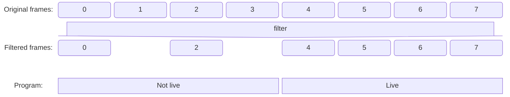

# OBS Frame Interleave Filter Plugin

## Introduction

This plugin interleaves video frames to reduce CPU and GPU usage.

While a video source is shown on at least one display, such as preview and program displays,
every video frame is transferred to the GPU.
If you have multiple video sources, a poor system might not have enough power to process all frames.
In such cases, this filter will be helpful to reduce the frames to be transferred if the video source is not shown in the program.

An example usage case is
- Studio Mode is enabled, and
- You have multiple asynchronous-video sources (such as capture cards).

The expected effect is the shorter rendering time or less number of missed frames.

A figure below shows a concept of how the frames will be processed by this filter.
While the source is not live on the program, some frames are discarded.
While the source is live, every frames will pass through this filter, ie. this filter do nothing.


## Properties

### Interleave time
Specify how much time the frame will be skipped to be transfered to GPU.

## Build and install
### Linux
Use cmake to build on Linux. After checkout, run these commands.
```
sed -i 's;${CMAKE_INSTALL_FULL_LIBDIR};/usr/lib;' CMakeLists.txt
mkdir build && cd build
cmake -DCMAKE_INSTALL_PREFIX=/usr -DCMAKE_INSTALL_LIBDIR=/usr/lib ..
make
sudo make install
```
You might need to adjust `CMAKE_INSTALL_LIBDIR` for your system.

### macOS
Build flow is similar to that for Linux.
